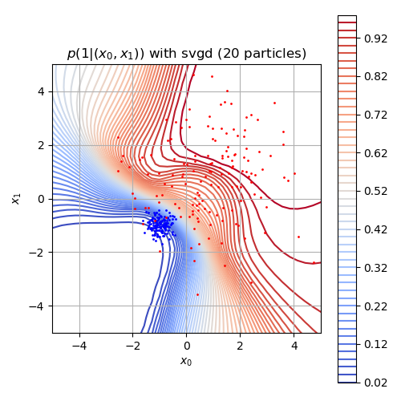
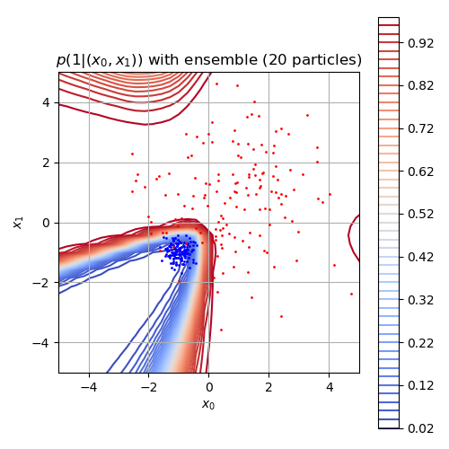

# Tensorflow Implementation of SVGD

## Bayesian Classification Example
-   I think this is a good example to apply tensorflow.
-   Joint prob. is p(w)p(x)p(0|x,w)^(1-y)p(1|x,w)^y, where w is the parameter, (x, y) is data. 
-   Since we have D = {(x_i, y_i)}, our goal is to find most probable parameter w
    by consider the posterior p(w|D).
-   I consider the following derivation:
    1. p(w)p(D|w) = p(w)p(x^N, y^N|w)
    2. log p(w)p(D|w) 
       = log p(w) + \sum_i (log p(xi) + (1-yi) log p(0|xi,w) + yi log p(1|xi,w))
        - We don't have to consider p(D), since we'll only consider gradient.
        - Cross entropy!
    3. The gradient over w also erase log p(xi)!
        - This leads for us to consider:
             - d log p(w) + \sum_i d {(1-yi) log p(0|xi,w) + yi log p(1|xi,w)}
        - However, if data size is large, hard to calculate the latter one.
    4. In SVGD paper, they subsample the data and scale it up.
         - d log p(w) + (N/|\Omega|)\sum_{i\in\Omega}  
            - The key is, (N/|\Omega|)
            - This differs from my work BGAIL.
                - For BGAIL, this might be sufficient. 
    5. If the uniform prior is used, the scale factor in 4. may not be needed!
    
## 2018/08/18
 -  flat gradient and variables make implementation much simpler! 
 -  unflattened gradient and its assignment to original vars should be implemented later!

## 2018/08/19
-   SVGD with Bayesian classification
    - NOTE: it should be gradient ascent
    - I should plot the contour.
-   Next, I'll try to implement default examples in SVGD.

## 2018/08/20
-   SVGD for toy example works
-   However, I can't find out proper setting of Adagrad optimizer in TensorFlow.
    Thus, I just choose AdamOptimizer and increase the learning rate. 
    This makes our proposal distribution converge to the target much faster.
-   I find out interesting example.
    
    
    </img>
    
    
    
    -   Thus, ensemble tries to strongly classify samples,
        whereas SVGD tries to draw the posterior.
-   Also, I found that ensemble doens't work in Gaussian mixture example.
